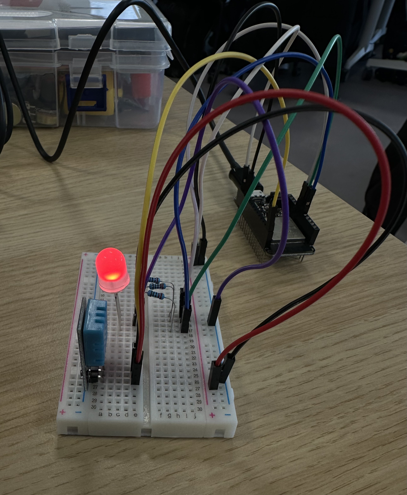
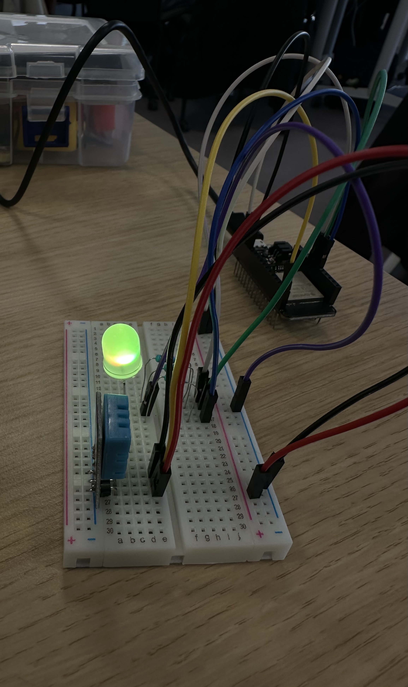
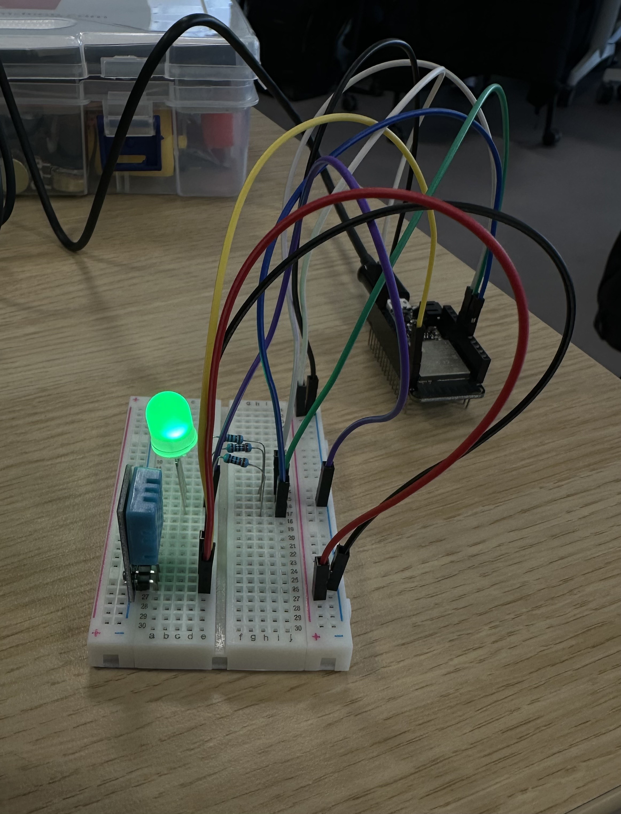
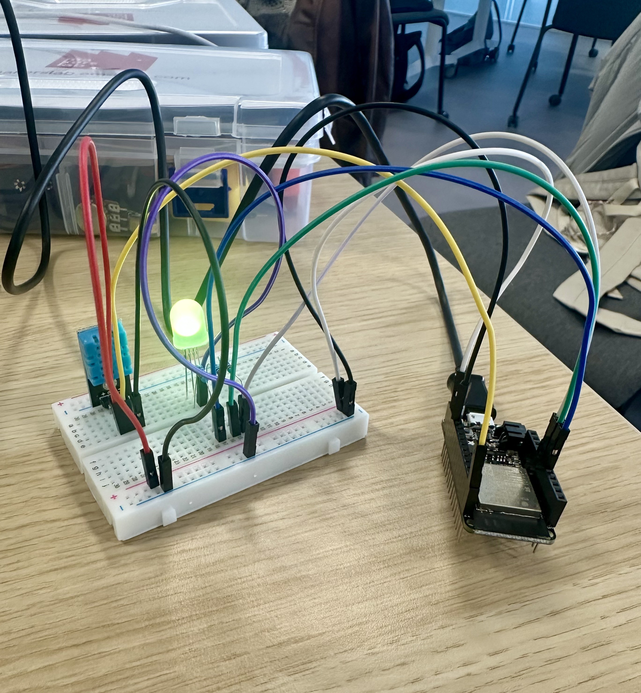

# Final Project

The final assigment for the Designing with Web and Connecting with IoT courses.

# CWIOT
### Schematic view
A schematic view of the projects circuit

### Images of working project

RGB LED changing color depending on the status

Project circuit

### Video

Video of the prototype updating values and switching colors accordingly

[See the video](https://drive.google.com/file/d/1MF--TyQnmTRQYTMNfvmJqYR_qIY0H-z3/view?usp=sharing)

# DWW
### Moodboard

### User flow
[See the user flow in figma]( https://www.figma.com/design/LfS8e3jmpKIom2if3jpPU6/project?node-id=36-126&t=JYhDkt8Jp4HlJGuq-1s)

